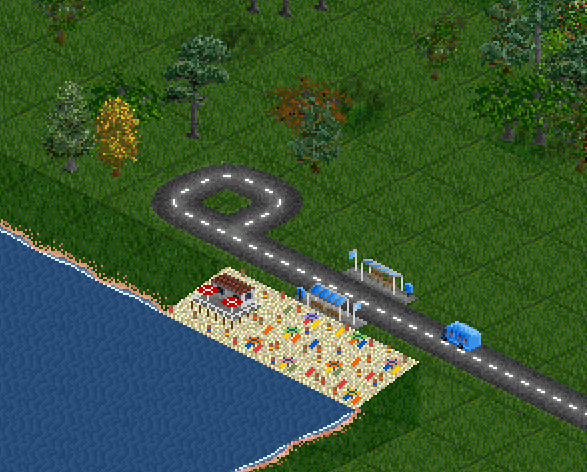

# Beaches as Industry

Beaches which produce and accept passengers. These are adapted from [Quast65's beach object tiles](https://www.tt-forums.net/viewtopic.php?t=62258), which are highly recommended in addition to this set for decoration.

## Generation and funding
- Beaches come in four slope directions, in three variants each measuring either 1x2 or 1x3 tiles.
- During map generation, beaches will only be created within 12 tiles of a town.
- There is a NewGRF parameter to set how many beaches are generated (Few or Many).
- The player can fund these industries anywhere for about the cost of a hotel in FIRS.

## Cargo
- The beaches produce and accept passengers in the same quantity as a FIRS hotel.
- When FIRS is enabled, the beach also accepts sand (for beach renewal, although this isn't modeled)

## Translations
- French (DonaldDuck313)
- Galician (pvillaverde)
- German (WoelfiVW)
- Spanish (pvillaverde)
- Spanish (Mexican) (pvillaverde)
- Swedish (DonaldDuck313)

## Credits
- Drawn by Quast65
- Coded by 2TallTyler